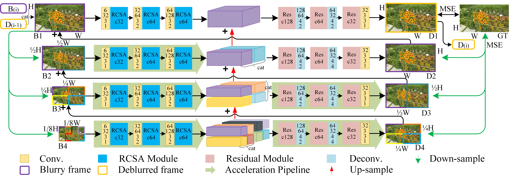
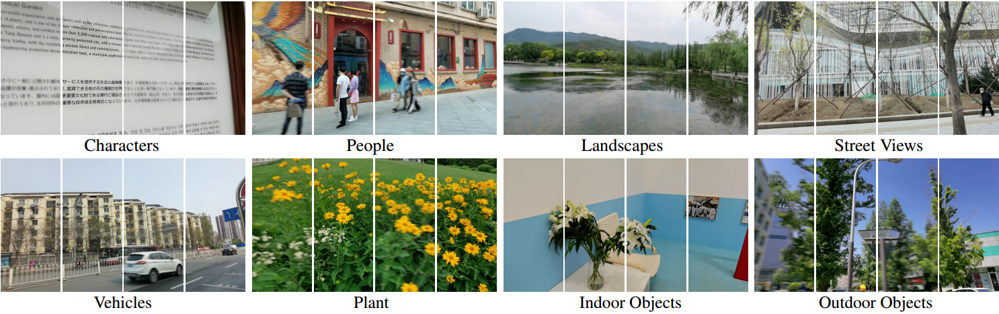

# Multi-Scale Separable Network for Ultra-High-Definition Video Deblurring
Pytorch Implementation of ICCV21 poster "Multi-Scale Separable Network for Ultra-High-Definition Video Deblurring" by Senyou Deng, Wenqi Ren\*, Yanyang Yan, Tao Wang, Fenglong Song, and Xiaochun Cao. <br/>
<br/>
The framework of our UHDVD model: <br/>


## 4KRD Dataset:
Some examples from our 4KRD dataset: <br/>

Please download training datasets (4KRD/GoPro/DVD/REDS) into './datas/XXXX'. [4KRD dataset here](https://drive.google.com/drive/folders/19bjJLMgQkwIAQaZYvsUhEVaxzJQFwhHF?usp=sharing) <br/>
Running the following command to obtain files: 'train_blur_list.txt' and 'train_sharp_list.txt' in './datas/XXXX'.
```
python txt_list.py
```

## Dependences:
4KRD pretrained models are stored in './checkpoints/4KRD'. 

__For requires, run following commands.__
```
pip install -r requirements.txt
```

## Running:
__For training, run following commands.__

```
python train_video.py -se start_epoch -g GPU_number
```

__For testing, put test samples as './test_set/XXXX/XXXX/blurry', then run following commands.__

```
python test_video.py -g GPU_number
```
The results will be saved at './test_set/XXXX/XXXX/deblur_4KRD'.

## Citation:
If you think this work is useful for your research, please cite the following paper.

```
@inproceedings{deng2021multi,
  title={Multi-Scale Separable Network for Ultra-High-Definition Video Deblurring},
  author={Deng, Senyou and Ren, Wenqi and Yan, Yanyang and Wang, Tao and Song, Fenglong and Cao, Xiaochun},
  booktitle={the IEEE/CVF International Conference on Computer Vision (ICCV)},
  pages={14030--14039},
  year={2021}
}
```
